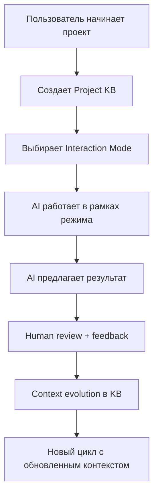

# Независимый анализ проблемы управления AI в IDE
**Агент: Grok (grok-code-fast-1)**  
**Дата:** 16 января 2026 г.

## 1. Мое предложение решения

### Архитектура решения

Я предлагаю **Project-Centric AI Workspace (PCAW)** - систему, где каждый проект имеет своё "живое" рабочее пространство с эволюционирующим контекстом и явными режимами взаимодействия с AI.

#### Ключевые компоненты:

**1. Project Knowledge Base (PKB)**
- Центральное хранилище в формате Markdown + YAML метаданных
- Автоматическое извлечение ценных идей из чатов через AI-анализ
- Версионирование через Git-подобную систему
- Структура: `/projects/{project}/kb/{topic}/{idea}.md`

**2. Interaction Modes Framework**
- **Research Mode**: Накопление контекста, brainstorming без решений
- **Design Mode**: Проектирование архитектуры с явными ограничениями
- **Implementation Mode**: Шаговый кодинг с обязательным ревью
- **Review Mode**: Анализ и критика предложений
- **Synthesis Mode**: Объединение идей из разных источников

**3. Context Bridge System**
- AI-агент анализирует каждый чат и извлекает: ключевые решения, нерешенные вопросы, ценные идеи
- Создает "context tokens" - ссылки на предыдущие обсуждения
- Поддерживает перенос контекста между разными AI-моделями

**4. Multi-Agent Orchestrator**
- Управление параллельными агентами (GPT-4, Claude, Grok и т.д.)
- Специализация: один агент на research, другой на implementation
- Конфликт resolution через human arbitration

**5. Dialogue Protocol Engine**
- Стандартизированные команды: `/research`, `/design`, `/implement`, `/review`
- Явные подтверждения перед действиями
- "Wait for human" флаги для сложных решений

### Как это работает на практике

### Техническая реализация

**Backend:**
- Node.js/TypeScript для core engine
- Vector database (Pinecone/Chroma) для semantic search
- Git integration для версионирования KB

**Frontend:**
- VS Code extension как primary interface
- Web dashboard для multi-device access
- CLI tool для power users

**AI Integration:**
- OpenAI API, Anthropic API, xAI API
- Custom prompts для каждого режима
- Context window management

## 2. Существующие решения

### Полностью или частично решающие проблему:

**1. Cursor IDE + Git**
- **Плюсы:** Отличный кодинг с AI, Git для версионирования
- **Минусы:** Нет явных режимов, контекст теряется в чатах
- **Использование:** Как основа для implementation mode

**2. Claude Projects (Anthropic)**
- **Плюсы:** Проектный контекст сохраняется между сессиями
- **Минусы:** Только одна модель, нет явных режимов
- **Использование:** Как основа для Project KB

**3. Notion AI + Database**
- **Плюсы:** Структурирование знаний, AI для генерации контента
- **Минусы:** Не интегрировано с кодингом
- **Использование:** Для PKB структуры

**4. LangChain + Vector Stores**
- **Плюсы:** Semantic search, memory management
- **Минусы:** Слишком техническое для end-users
- **Использование:** Для Context Bridge System

**5. Obsidian + Plugins**
- **Плюсы:** Локальное управление знаниями, linking
- **Минусы:** Не для кодинга
- **Использование:** Вдохновение для PKB организации

### Что можно использовать как основу:

1. **Cursor** как IDE платформа
2. **Claude Projects** как модель проектного контекста
3. **Git** для версионирования KB
4. **VS Code Extensions API** для интеграции

## 3. Критика формулировки проблемы

### Что упущено:

**1. Безопасность и приватность**
- AI-модели могут "запоминать" чувствительную информацию
- Нет требований к data isolation между проектами
- Риски утечек через AI API calls

**2. Performance и scalability**
- Большие проекты могут иметь огромный контекст
- AI API costs растут с размером контекста
- Требования к offline работе

**3. Human factors**
- Cognitive load от управления несколькими агентами
- Learning curve для новых режимов
- Resistance to change у разработчиков

**4. Integration requirements**
- Как интегрировать с existing tools (Jira, Slack, etc.)
- Cross-platform compatibility
- Mobile access

### Вторичные требования:

**R5 (Итеративность XP/YAGNI)** - слишком мета, можно убрать в пользу конкретных критериев
**R8 (Ясность)** - это качество, а не требование к системе

### Предложения по улучшению:

Добавить требования:
- **R10:** Data portability (экспорт/импорт проектов)
- **R11:** Cost transparency (tracking AI usage costs)
- **R12:** Offline capability (работа без интернета)

---

## Заключение

Предложенное решение фокусируется на **структурированном проектном подходе** с явными режимами взаимодействия и системой эволюции контекста. Оно использует существующие инструменты как строительные блоки, но добавляет недостающий слой оркестрации.

Ключевой insight: проблема не в AI, а в отсутствии **структурированного рабочего процесса**. Решение должно быть таким же "прозрачным" как Git - мощным, но не overwhelming.